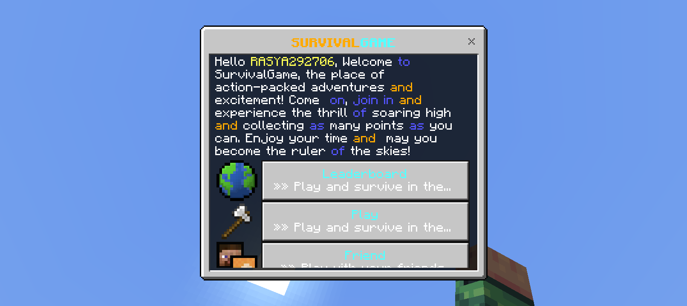

# SurvivalGame Plugin

**SurvivalGame** is a plugin for Minecraft Pocket Edition using PocketMine-MP that lets you play in survival mode with exciting features. Players can join the survival game, fight other players, and try to survive until the end.

## Features
- Add Scoreboard.
- Leaderboard and statistics features.
- Lobby Waiting.
- UI for accessing settings and helping players.
- And More.

## Screenshot
**/survivalgame** To OpenUI

## Commands

`/survivalgame help`
Displays a list of commands and instructions on how to use the plugin.
*/survivalgame add
/survivalgame reload
/survivalgame list
/survivalgame setlobby
/survivalgame edit <arenaname>		
/survivalgame search <arenaname>
/survivalgame generate <arenaname>
/survivalgame remove <arenaname>*
